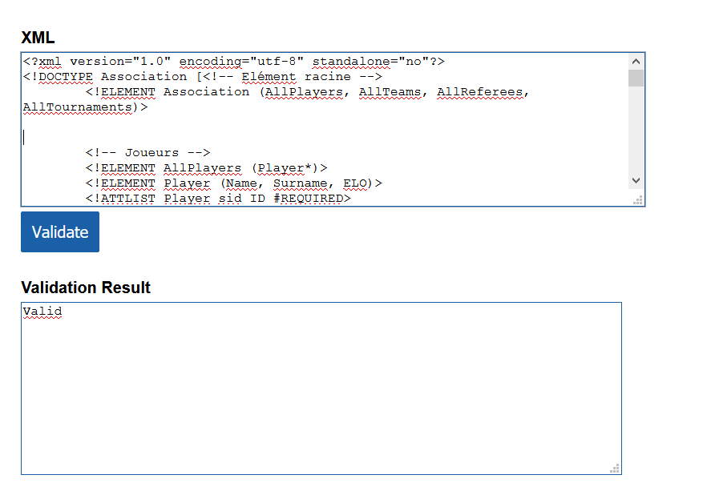

# SER-LAB1

## Introduction

Nous sommes mandatés par "Enjoy Chess", une association organisatrice de tournoi d'échecs, afin de créer et structurer un document XML selon les demandes et besoins de l'association. On va souhaiter enregistrer des tournois dans ce fichier XML et on souhaite être le plus efficace possible tout en minimisant l'information stockée. La particularité de ces tournois d'échecs est qu'ils ne constituent que des parties se jouant en équipe de 2 joueurs sur 2 échiquiers différents.

Nous devons modéliser les informations suivantes : 

* Une partie d'échecs
  * Se joue entre 2 équipes
  * Se joue sur 2 échiquiers différents
  * Fait partie d'un tournoi
* Chaque équipe joue les 2 camps dans les 2 échiquiers
* Nom et prénom de l'arbitre s'occupant de la partie
* Liste des arbitres exerçant dans le tournoi
* Les informations de chaque joueurs
  * Numéro de sécurité social
  * Nom et prénom
  * Classement ELO
* Date et heure auquel la partie à été jouée
* Le score final de la partie
* Tous les coups joués durant la partie
* L'équipe vainqueur du tournoi

## Choix pour la DTD

### Ids
Les conventions suivantes ont été choisies pour le format des Ids des différents éléments:
Le symbole "#" représente un nombre.
- Player: sid = "P#"
- Team: id = "T#"
- Referee: id = "R#"

### Equipes
- Composition: La composition d'une équipe ne varie pas d'un tournoi à l'autre

### Match
- Echiquier: Nous avons choisi comme convention que le 1er joueur de l'équipe A jouerait en blanc sur l'échiquier A
contre le 1er joueur de l'équipe B et par symmétrie que ce sera le 2ème joueur de l'équipe B qui jouera les blancs
contre le 2ème joueur de l'équipe A
- Balises Score: Nous avons choisi comme convention que la 1ère balise score correspond au score de la teamA
et la 2ème celui de la teamB

## Validation du XML

N.B: Pour la validation du document XML nous avons du écrire la DTD en interne
## Réponses aux questions

> Imaginons que vous souhaitez enregistrer le classement ELO que chaque joueur d'une partie avait au moment où elle a été jouée, qu'est-ce qu'il faudrait modifier dans votre DTD ?

On ajoutera dans la balise Match 2 balises ELOTeam (une pour chaque équipe) avec comme attributs ELO-P1 (Le ELO du 1er joueur) et ELO-P2 (Le ELO du 2ème joueur)
On écrirait cette balise ELOTeam de cette manière dans la DTD:
```
<!ELMENT ELOTeam> 
<!ATTLIST ELOTeam ELO-P1 CDATA #REQUIRED>
<!ATTLIST ELOTeam ELO-P2 CDATA #REQUIRED>
```
> Il est possible dans votre DTD de représenter le fait qu'il ne peut y avoir que 20 parties par tournoi. Comment faire ? Discutez également de votre solution à ce problème.

Il y a une solution simple mais peu élégante qui serait de mettre 20 fois la balise Match dans la balise Matchs
On écrirait celà de cette manière dans la DTD:
```
<!-- Ecrire 20 fois Match -->
<!ELEMENT Matchs (Match, Match, Match, ..., Match)> 
```
> Est-ce possible dans votre DTD d'interdire le fait qu'une équipe joue contre elle-même dans une partie ? Justifiez votre réponse.

Non, car on ne peut pas définir le contenu d'un attribut en fonction d'un autre. On ne peut pas stipuler dans la DTD que
le contenu de teamA doit être différent de teamB

> Est-ce possible dans votre DTD de vérifier que pour une partie, l'arbitre fait bien partie du tournoi dans lequel la partie en question est jouée ? Justifiez votre réponse.

Non, car le DTD ne peut pas vérifier ce que référence un attribut IDREF, il va juste vérifier que cet ID existe au moins dans un champ ID.
Il ne sait donc pas que refereeId référence un arbitre, il lui est donc impossible de comparer différents ID.

## Conclusion
Ce labo nous a bien fait exercé la syntaxe XML et nous a montré les limites, parfois contraigantes qu'elles nous imposaient. 
Nous avons pu créer un document XML fonctionnel avec une DTD externe dans le cas d'une application pratique.